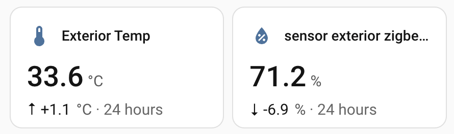
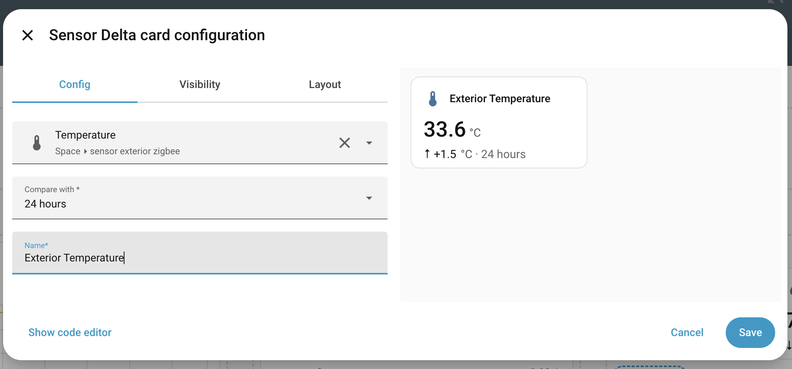
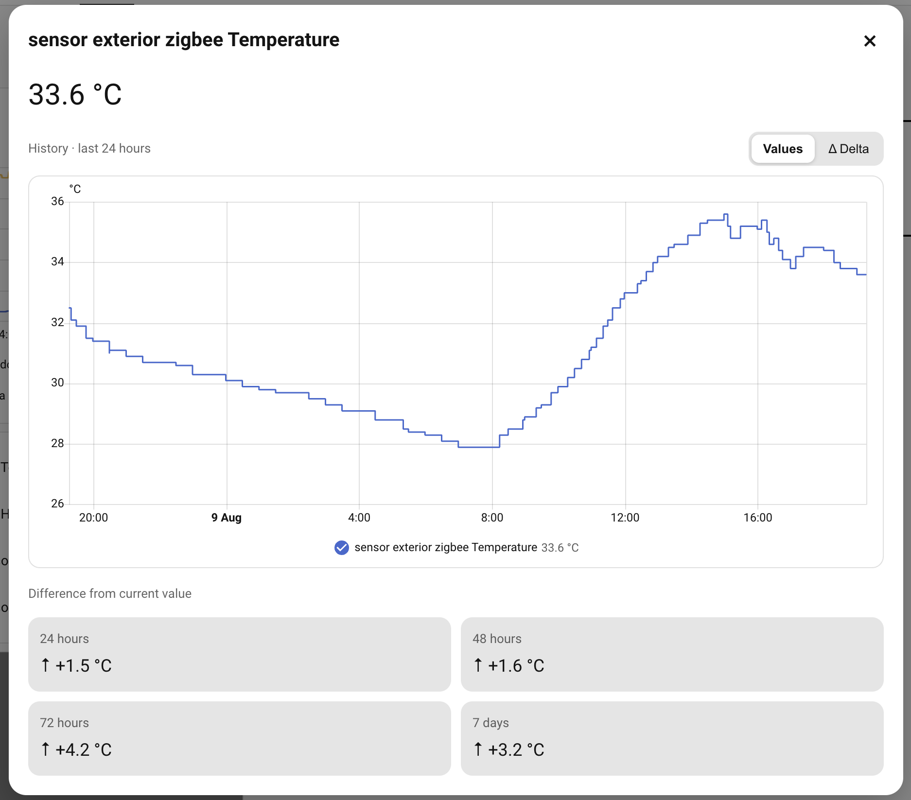
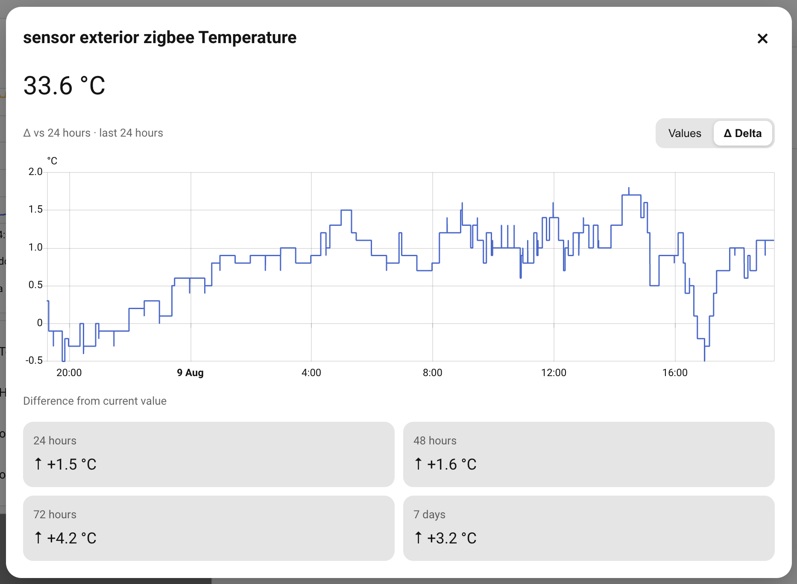

# Sensor Delta Card

A Home Assistant dashboard card for seeing a numeric sensor's **current value and change over time** at a glance.

Sensor Delta Card is designed for temperature, humidity, pressure, CO₂ and other numeric `sensor.*` entities. The compact card shows the current value and the delta against a selected comparison period. Clicking the card opens a detailed view with Home Assistant's native history graph, a delta-history view, and summary deltas for 24 h, 48 h, 72 h and 7 days.

> **Release:** v0.6.1

## Features

- Visual Home Assistant card editor — no YAML required for normal setup.
- Searchable native Home Assistant entity picker.
- Comparison periods: **24 h, 48 h, 72 h, or 7 days**.
- Optional custom card title.
- Compact current value + delta display.
- Detail popup with:
  - native localized last-update time below the current value;
  - native Home Assistant 24-hour value history;
  - **Values / Δ Delta** graph toggle;
  - 24 h, 48 h, 72 h and 7-day delta summaries.
- Lazy history loading to reduce unnecessary Recorder queries.
- No helpers, template sensors or persistent synthetic entities.
- Delta chart uses a frontend-only temporary entity overlay; nothing is created in Home Assistant or written to Recorder.
- Automatic English and Spanish UI; English is the fallback for other languages.
- Works with Home Assistant light/dark themes.

## Screenshots

### Dashboard cards



### Visual editor



### Value history



### Delta history



## Installation

### HACS — custom repository

The easiest installation method is through HACS. If HACS is not installed yet, follow the [HACS installation guide](https://www.hacs.xyz/docs/use/download/download/).

#### Open directly in HACS

[](https://my.home-assistant.io/redirect/hacs_repository/?owner=jesuslg123&repository=HA-sensor-delta-card&category=plugin)

Select the button, choose your Home Assistant instance, and HACS will open this repository. Then select **Download** and confirm the latest version.

If the button does not work for your setup, add the repository manually:

#### Add the repository manually

1. Open **HACS** in Home Assistant.
2. Open the three-dot menu in the top-right corner and select **Custom repositories** (or **Add custom repositories**).
3. Paste this URL into **Repository**:

   ```text
   https://github.com/jesuslg123/HA-sensor-delta-card
   ```

4. Select **Dashboard** as the **Type**.
5. Select **Add**.

#### Download the card

1. Search HACS for **Sensor Delta Card** and open it.
2. Select **Download** in the bottom-right corner.
3. Keep the latest version selected and confirm **Download**.
4. When the download finishes, refresh Home Assistant. A hard refresh may be needed:
   - macOS: **Command + Shift + R**
   - Windows/Linux: **Ctrl + Shift + R**

HACS normally registers the dashboard resource automatically. You can then edit a dashboard and select **Add card → Sensor Delta**.

#### Updating through HACS

When HACS shows an available update, open **Sensor Delta Card**, select **Update** or **Redownload**, and refresh Home Assistant after it finishes. To check immediately, use the repository's three-dot menu and select **Update information**.

For more detail, see the official HACS guides for [custom repositories](https://www.hacs.xyz/docs/faq/custom_repositories/) and [downloading dashboard repositories](https://www.hacs.xyz/docs/use/repositories/dashboard/).

### Manual installation

1. Copy `dist/sensor-delta-card.js` to:

   ```text
   /config/www/sensor-delta-card.js
   ```

2. In Home Assistant open **Settings → Dashboards → Resources**.
3. Add:

   ```text
   /local/sensor-delta-card.js
   ```

   as a **JavaScript Module**.
4. Reload the frontend.

For development, a cache-busting resource such as `/local/sensor-delta-card.js?v=0.6` can be useful.

## Adding a card

Edit a dashboard and choose **Add card → Sensor Delta**.

The visual editor provides:

- **Entity** — searchable numeric sensor selector.
- **Compare with** — 24 h, 48 h, 72 h or 7 days.
- **Name** — optional custom title.

Equivalent YAML:

```yaml
type: custom:sensor-delta-card
entity: sensor.bedroom_temperature
compare_hours: 24
name: Bedroom temperature
```

`name` is optional.

## How the delta is calculated

For the compact card:

```text
delta = current value - historical value at the configured comparison period
```

For example, with `compare_hours: 24`, a current value of `25.4 °C` and a historical value of `24.7 °C` gives:

```text
+0.7 °C
```

The detail popup always shows summary comparisons for:

- 24 hours
- 48 hours
- 72 hours
- 7 days

The **Δ Delta** graph displays the evolution over the last 24 hours of:

```text
value(t) - value(t - configured comparison period)
```

For a 24-hour comparison, every point is therefore compared with the value at the same time one day earlier.

## History and Recorder

The card depends on Home Assistant history/Recorder data.

The compact card requests only a small historical window around the configured comparison instant. The larger history request is lazy-loaded only when the detail popup is opened.

For the delta graph, enough history must exist for both the displayed 24-hour window and the configured offset. A 7-day delta graph therefore needs roughly 8 days of retained history.

If Recorder has purged the required data, the card cannot calculate that comparison.

## Supported entities

The visual editor lists `sensor.*` entities whose current state is numeric.

Typical examples:

- temperature
- humidity
- pressure
- CO₂
- power
- voltage
- illuminance

Units are taken from the selected Home Assistant entity.

Entities whose state is `unknown`, `unavailable`, or otherwise non-numeric cannot provide a current delta until they return to a numeric state.

## Native Home Assistant components

The card intentionally reuses Home Assistant frontend components where practical, including the entity picker, selectors and history/chart components. This keeps the experience visually consistent with Home Assistant.

The delta chart is calculated in the browser. A temporary synthetic entity exists only in the JavaScript object passed to the native chart. It does **not** create a Home Assistant entity, helper, database row or Recorder entry.

## Languages

Currently included:

- English
- Spanish

The language is selected from `hass.locale.language`. Unsupported languages fall back to English.

## Troubleshooting

If an update appears not to load, perform a hard refresh. On Edge/Chrome for macOS use **Command + Shift + R**. For development, open DevTools → Network → **Disable cache** and reload.

The browser console prints the loaded version:

```text
SENSOR-DELTA-CARD v0.6
```

If the history is empty, verify that the selected entity has Recorder history for the required period.

## HACS repository structure

This release package is prepared as a HACS **Dashboard/plugin** repository:

```text
sensor-delta-card/
├── .github/
│   └── workflows/
│       └── validate.yml
├── dist/
│   └── sensor-delta-card.js
├── .gitignore
├── CHANGELOG.md
├── hacs.json
├── LICENSE
└── README.md
```

HACS looks for plugin JavaScript in `dist/` before the release/root and requires a matching JavaScript filename for the repository. If the GitHub repository is named `sensor-delta-card`, keep the distributed file named `sensor-delta-card.js`.

## Publishing to HACS

For a custom HACS repository, publish this folder as a **public GitHub repository**, give it a short description, enable Issues, and add repository topics such as:

```text
home-assistant
hacs
lovelace
custom-card
dashboard
temperature
humidity
```

Then users can add it as a custom HACS **Dashboard** repository.

For submission to the default HACS catalog, also:

1. Ensure the HACS validation workflow passes.
2. Publish a **GitHub Release** (a tag alone is not sufficient for the default catalog submission).
3. Submit the repository to the plugin list in `hacs/default`.

## Release process

Recommended release flow:

```text
1. Update CARD_VERSION in dist/sensor-delta-card.js.
2. Update CHANGELOG.md.
3. Commit and push.
4. Wait for HACS validation to pass.
5. Create a GitHub release tagged vX.Y.Z.
6. Test installation/update through HACS.
```

Because the distributable JavaScript is already committed in `dist/`, no build step is required for this project.

## Compatibility note

This card uses Home Assistant frontend components, including chart components that are not a formal third-party API. Home Assistant frontend changes may occasionally require updates to the card. Pinning/testing releases against current Home Assistant versions is recommended.

## License

MIT. See [LICENSE](LICENSE).
